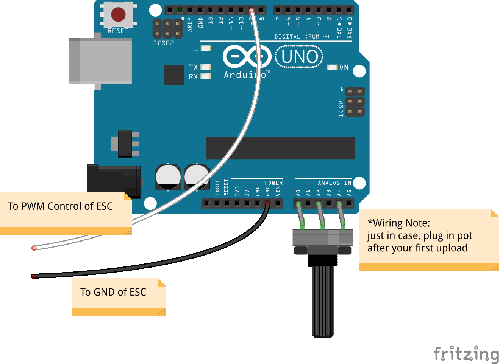

Arduino-Quadracopter
====================

This is code and schematics to control a Brushless DC Motor and ESC using an Arduino. 

You can adapt this code easily to control quadracopter motors via ESC's.

## Description of Files

```bash
.
├── Automatic_Control.ino
├── Manual_Control.fzz
├── Manual_Control.ino
├── Manual_Motor_Control.png
└── README.md
```
- `Manual_Control.ino` start with this and see the [Schematic](#schematic) below
- `Automatic_Control.ino` provides a sequence example, even simpler setup than Manual
## Wiring Notes

### For Manual control

If using the manual control setup, it may be best to plug the pot in after doing your first upload.

### Connecting the ESC-To-BrushlessDCMotor
the three wires from the ESC to the Brushless DC motor can be **in any order**.

In order to reverse the default direction, **swap any two wires** from the ESC-to-BrushlessDCMotor connection.

### Common Ground

Have everything share a common ground (you can also choose to power your arduino from the ESC's red wire if you want)

## Schematic



## BOM

Todo

## Credits && References


http://dronesandrovs.files.wordpress.com/2012/11/esc-brushless.png

http://www.youtube.com/watch?v=48MQR3UV7x0
